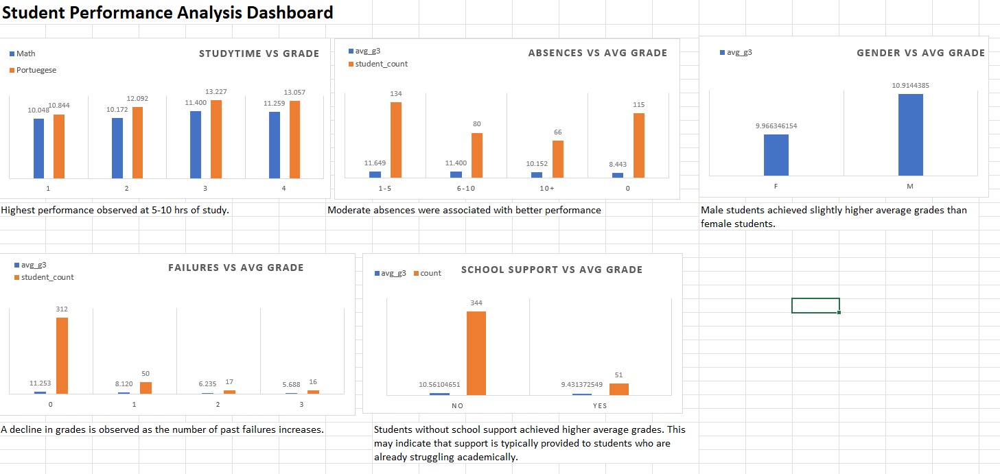

# Student Performance Analysis (SQL + Excel)

## Objective
To analyze factors affecting student performance using SQL and Excel.

## Dataset
- UCI Student Performance Dataset
- Subjects: Math and Portuguese

## Tools Used
- PostgreSQL
- Microsoft Excel

## Key Questions
- Does study time affect grades?
- Do absences impact performance?
- Do past failures affect results?
- Does school support help?
- Is there a difference between male and female performance?

## Key Insights
- Study time shows a non-linear relationship with performance.
- Moderate absences were associated with better performance.
- A decline in grades is observed as past failures increase.
- Students without school support achieved higher average grades.
- Male students achieved slightly higher average grades than female students.

## Dashboard

## Data Note
Due to the absence of a unique identifier, both datasets were analyzed separately and compared at an aggregated level.

## Conclusion
Student performance is influenced by multiple factors and relationships are not always linear.